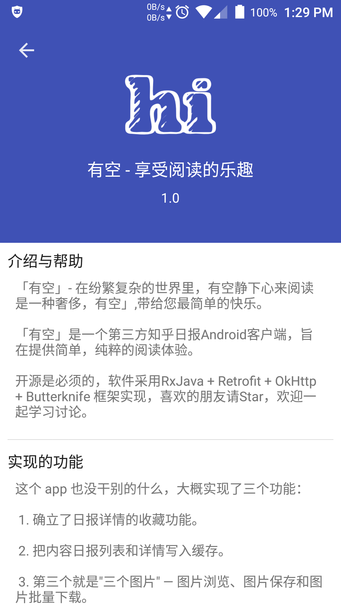

# 有空
这是一个第三方知乎日报客户端最纯净的知乎日报客户端，界面简介，运行流畅。 
软件为 MVP 架构，采用RxJava + Retrofit + OkHttp框架实现，遵循Material Design，界面简单干净，运行速度快，自动离线缓存，节省流量，对于页面加载及错误等都做了处理。向比较其他第三方客户端，实现了知乎日报中的图片浏览、保存以及批量下载，可以将内容进行收藏，存为本地的 html,可以在无网络情况下的阅读。

## 实现的功能
这个 app 也没干别的什么，大概实现了三个功能：  
1. 确立了日报详情的收藏功能.  
2. 把内容日报列表和详情写入缓存。  
3.  第三个就是 **"三个图片"** — 图片浏览、图片保存和图片批量下载。 

如果说还有一点成绩就是，所有界面一律滑动返回和列表头部点击回到顶部，这个对用户体验有很大的关系。

还有就是夜间模式也是很大的一个功能。

但这些都是次要的，主要就三个功能，很惭愧，就做了一点微小的工作，欢迎一起交流。

## 一、设计理念
「有空」- 在纷繁复杂的世界里，每个都在不停的忙碌，满足上班，忙着下班，忙着社交，忙着约会......

有空成为一种奢侈，愿你在喧闹中，享受这一刻的美好。「有空」带给你最纯粹的阅读体验，每天 21 分钟，让思绪在文字中流淌。

有空带来最简洁的界面，去除其他无用功能，专注于阅读。

统一的操作体验，从首页进入的任何界面，都实现了滑动返回；任何有列表的界面，敲击界面顶部的 ToolBar 即可回到顶部。

## 二、软件截图

<table>
<tr>
<th>首页列表界面</th>
<th>夜间模式界面</th>
</tr>
<tr>
<td></td>
<td></td>
</tr>
</table>

<table>
<tr>
<th>内容详情界面</th>
<th>图片处理界面</th>
</tr>
<tr>
<td></td>
<td></td>
</tr>
</table>

<table>
<tr>
<th>图片浏览界面</th>
<th>滑动返回界面</th>
</tr>
<tr>
<td></td>
<td></td>
</tr>
</table>

<table>
<tr>
<th>滑动删除界面</th>
<th>关于界面界面</th>
</tr>
<tr>
<td></td>
<td></td>
</tr>
</table>

## 三、依赖库
* [RxJava 响应式编程框架](https://github.com/ReactiveX/RxJava)
* [Retrofit2.0 REST安卓客户端请求库](https://github.com/square/retrofit)
* [OkHttp3 网络请求](https://github.com/square/okhttp)
* [Glide 图片加载](https://github.com/bumptech/glide)
* [ButterKnife 依赖注入](https://github.com/JakeWharton/butterknife) 

感谢开源世界的帮助！
## 四、感谢
Retrofit — Getting Started and Create an Android Client
 https://futurestud.io/blog/retrofit-getting-started-and-android-client 

感谢 [laucherish](https://github.com/laucherish) 的纯净知乎日报给我的启发
 https://github.com/laucherish/PureZhihuD.git 

## 五、声明
应用中展示的所有内容均搜集自互联网，若内容有侵权请联系作者进行删除处理。本应用仅用作分享与学习。

